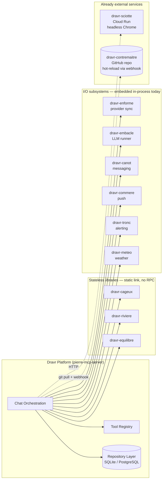
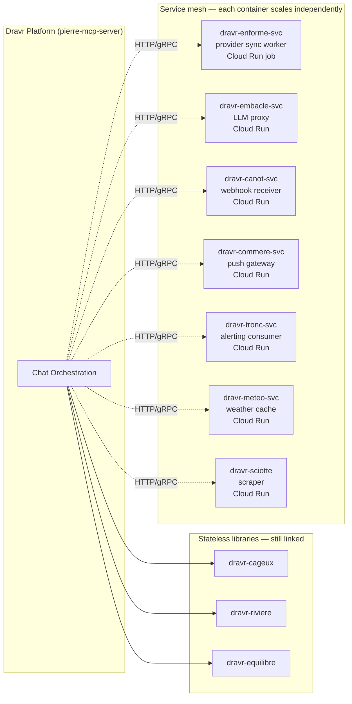

<div align="center">
  
  <h1>Dravr Platform</h1>
  <p><em>Multi-tenant fitness coaching platform — same coach, every surface (web, mobile, MCP, messaging), with sports-science guardrails on every claim.</em></p>
</div>

[](https://github.com/dravr-ai/dravr-platform/actions/workflows/ci-backend.yml)
[](https://github.com/dravr-ai/dravr-platform/actions/workflows/ci-postgres.yml)
[](https://github.com/dravr-ai/dravr-platform/actions/workflows/frontend-tests.yml)
[](https://github.com/dravr-ai/dravr-platform/actions/workflows/sdk-tests.yml)
[](https://github.com/dravr-ai/dravr-platform/actions/workflows/mcp-compliance.yml)
[](https://github.com/dravr-ai/dravr-platform/actions/workflows/integration-tests.yml)
[](https://github.com/dravr-ai/dravr-platform/actions/workflows/mobile-e2e-ios.yml)

---

## What this is

Dravr is the platform behind [dravr.ai](https://dravr.ai). It runs an AI fitness coach that lives wherever the user already is — chat apps, a mobile app, a web dashboard, or any AI assistant that speaks the [Model Context Protocol](https://modelcontextprotocol.io/).

The interesting bit isn't "an LLM that talks fitness." It's the architecture that turns a chat turn into a verifiable, tenant-scoped, provider-grounded coaching answer:

- A **coach** is a tenant-scoped persona — a system prompt plus a category, plus tier-specific behaviour rules — not a free-form chat session.
- Every coach turn is **decomposed into atomic claims** and run through a layered verifier (heuristic + LLM-as-judge) before it reaches the user. False or unsupported physiological / nutrition / training-prescription claims are flagged, scored, and stored against the conversation turn.
- Every coach turn is **grounded in real provider data** — Strava activities, WHOOP sleep, Garmin HRV — fetched through tool calls, not hallucinated from an activity title.
- Every coach turn **streams identically** to whichever surface initiated it, via a single AG-UI event channel that all frontends and chat adapters subscribe to.

## The system, end to end

```
                ┌─────────── surfaces ───────────┐
   web (Vite)   mobile (Expo)   MCP (stdio/HTTP)   messaging (TG/Slack/Discord/WA/FB)
                            │
                            ▼
            ┌─────────────────────────────────────┐
            │  Transport layer (HTTP/SSE/WS/stdio)│
            │  Protocol adapters (REST/MCP/A2A)   │
            └─────────────────────────────────────┘
                            │  (auth, tenant resolution, CSRF, rate limit)
                            ▼
            ┌─────────────────────────────────────┐
            │   Chat orchestration (one path)     │
            │  ┌────────────────────────────────┐ │
            │  │ Coach harness pipeline:        │ │
            │  │  1. memory recall + compaction │ │
            │  │  2. persona + coach prompt     │ │
            │  │  3. tool registry dispatch     │ │
            │  │  4. LLM tool-loop              │ │
            │  │  5. claim extraction           │ │
            │  │  6. claim verification         │ │
            │  │  7. coach notes + followups    │ │
            │  └────────────────────────────────┘ │
            │   AG-UI events fan out at every step│
            └─────────────────────────────────────┘
                │                  │             │
                ▼                  ▼             ▼
       Provider abstraction   LLM abstraction   Repository abstraction
        Strava, Garmin,        Gemini, Groq,    SQLite | PostgreSQL
        WHOOP, Fitbit,         OpenAI, Ollama,  every query is
        COROS, Terra, ...      Copilot ACP      tenant_id-scoped
                │                  │
                └─── activity ─────┘
                     streams,
                     sleep, HRV
```

Every surface lands on the **same chat orchestration**. There is no "mobile pipeline" vs "web pipeline" — the channel adapter is responsible only for transport and rendering; the coaching logic is invariant.

## Architectural pillars

### Surface convergence

The web app, mobile app, MCP clients, and messaging adapters all hit the same orchestration. Surfaces differ only in:

- **Auth shape** — JWT (web/mobile), MCP token (CLI assistants), per-channel signed webhooks (Telegram/Slack/Discord/WhatsApp/Messenger).
- **Rendering** — markdown blocks for chat surfaces, AG-UI step events for streaming surfaces, plain-text fallbacks for SMS-grade channels.
- **Latency budget** — chat surfaces tolerate streaming with progressive AG-UI events; webhook channels render a "thinking…" message that gets edited in place as `STEP_FINISHED` events arrive.

A coach exists once. Its behaviour is identical on every surface.

### The coach harness pipeline

A "coach turn" is a deterministic state machine, not a single LLM call. Each tier is independently observable and independently testable.

| Tier | Responsibility | What it produces |
|---|---|---|
| 0 — Persona | Render base persona (casual / professional / supportive / direct) | System prompt header |
| 1 — Coach | Inject tenant-scoped coach prompt from a hot-reload registry | Coach domain expertise |
| 2 — Memory | Recall extracted user facts (goals, equipment, injuries) + coach-authored notes | User context |
| 3 — Compaction | Summarise oldest N turns when window crosses warning threshold | Bounded context window |
| 4 — Tool dispatch | Capability-filtered MCP tool registry runs the LLM tool-loop | Tool calls + provider data |
| 5 — Guardrails | Token caps, blocked-topic filtering, disclaimer injection | Bounded output |
| 5.5 — Claim verifier | Decompose response → atomic claims → heuristic + judge verdict | Verdict store, audit trail |
| 6 — Memory write-back | Extract new facts from the turn, persist coach notes / follow-ups | Updated user model |

Every tier emits AG-UI `STEP_STARTED` / `STEP_FINISHED` events so subscribers can show real-time progress instead of a spinner. Every tier is reconfigurable at runtime via the admin "Harness Config" panel — no redeploy.

### Provider abstraction

Fitness providers are behind a single `Provider` trait. Adding a provider means implementing the trait and gating a feature flag — the rest of the system is provider-agnostic.

| Concern | How it's solved |
|---|---|
| OAuth lifecycle | Per-tenant token store; transparent token refresh inside tool execution. |
| Activity normalization | Provider-specific responses are normalised through `dravr-cageux` / `dravr-riviere` / `dravr-equilibre` into a canonical activity / sleep / recovery model. |
| Sync | `dravr-enforme` runs scheduled background sync per provider per tenant. |
| Restricted jurisdictions | Sciotte (`dravr-sciotte`) ships a Strava mirror via headless Chrome where Strava's OAuth API isn't an option. |

Coaches see a `&dyn Provider`. They never know whether the data came from Strava OAuth, a Garmin webhook, or a Sciotte scrape.

### LLM abstraction

LLM backends are interchangeable per tenant. Tool-loop dispatch picks one of three execution strategies based on the model's declared capabilities:

- **API tool-loop** — for vendors with native function-calling (OpenAI-compatible, Gemini).
- **Headless tool-loop** — for transports where tool calls go over Agent Client Protocol (Copilot via `dravr-embacle`).
- **CLI tool-loop** — for local models without protocol support; uses text-based tool emission.

A single `LlmProvider` trait abstracts all three; orchestration code is identical regardless of which backend is configured.

### Multi-tenant by construction

Tenant isolation is a CI-enforced invariant, not a runtime convention.

- Every database query includes `tenant_id` in the `WHERE` clause. An architectural-validation script fails CI on missing scoping.
- OAuth tokens, API keys, LLM credentials, cache keys are all per-tenant. There is no global / shared store.
- Admin operations that touch a coach or a user must verify the target's tenant matches the caller's, including system coaches (which are pinned to the seed tenant but accepted unconditionally for read/use, only).
- The frontend admin console runs under super-admin impersonation, but every route still goes through the same tenant resolver — there's no impersonation-only data path.

### External `dravr-*` modules — embedded today, extractable as services

The platform is composed against a set of independently versioned `dravr-*` modules. They split cleanly along an axis the architecture has been designed around: **stateless / CPU-bound libraries that don't benefit from RPC** vs. **stateful / I/O-bound subsystems that are natural service boundaries**.

| Module | Role | Today | Extractable as service? |
|---|---|---|---|
| `dravr-cageux` | Sports-science formulas (training load, race predictions, fitness scoring) | Static link | No — pure CPU, RPC overhead dwarfs the work |
| `dravr-riviere` | Time-series primitives for activity streams | Static link | No — same reason |
| `dravr-equilibre` | Health / recovery domain models (sleep, HRV, strain) | Static link | No — same reason |
| `dravr-enforme` | Provider sync harness (Strava / Garmin / WHOOP) | In-process worker | Yes — natural sync worker / Cloud Run job |
| `dravr-embacle` | LLM runner (Copilot ACP, OpenAI, Gemini transports) | Static link + child process for ACP | Yes — natural inference proxy |
| `dravr-canot` | Messaging gateway (Telegram / Slack / Discord / WA / Messenger) | In-process webhook handlers | Yes — extracts as a webhook receiver service |
| `dravr-commere` | Push-notification service (APNs, FCM) | In-process | Yes — natural push gateway |
| `dravr-tronc` | Notification / alerting layer | In-process | Yes — natural pubsub consumer |
| `dravr-meteo` | Weather lookups | In-process HTTP client | Yes — small caching service |
| `dravr-sciotte` | Headless-Chrome Strava mirror scraper | **Already a service** — separate Cloud Run | (already extracted) |
| `dravr-contremaitre` | System prompts + coach definitions | **Already external** — separate GitHub repo, hot-reloaded over webhook | (already extracted) |

**Today — embedded composition:**



**Tomorrow — service extraction path (incremental, per-module):**



**Why the embedded-first design.** The crates expose clean library APIs (no `&self.db`, no global state) so wrapping them in a thin HTTP/gRPC server is a mechanical change, not a refactor. We keep them in-process until a real signal demands extraction:

- **Independent scaling** — when scraper or LLM-proxy load patterns diverge from chat-orchestration load patterns.
- **Blast-radius isolation** — a Chrome OOM in `sciotte` already takes down its own pod, not the orchestrator. Same model extends to the others.
- **Polyglot deployments** — Telegram-only edge nodes that need just `dravr-canot` and a tiny embacle.
- **Cost control** — push and alerting can run on cheaper instance shapes than the orchestrator.

Adding a service for any of the extractable modules is: ship a thin binary that exposes the library trait over HTTP/gRPC, swap the in-process call for a client behind the same Rust trait the orchestrator already uses. Call sites do not change.

### Hot-reloadable prompts

System prompts and coach personas don't ship in the binary. They live in [`dravr-contremaitre`](https://github.com/dravr-ai/dravr-contremaitre) under `prompts/coaches/<category>/<slug>/<locale>.md`, and the server hot-reloads them on startup and on webhook from the contremaitre repo. Editing a coach prompt is a content change, not a deploy.

### Streaming via AG-UI

Real-time progress on every surface is delivered through the [AG-UI protocol](https://github.com/ag-ui-protocol/ag-ui). The orchestrator emits `RUN_STARTED` / `STEP_STARTED` / `STEP_FINISHED` / `RUN_FINISHED` / `RUN_ERROR` events into a per-run sink; SSE subscribers fan them out to whichever surface is rendering. Telegram-style webhooks consume the same stream and edit a "thinking…" message in place as steps complete.

### Dual storage backend

The repository layer abstracts SQLite and PostgreSQL behind the same trait set. SQLite is the default for local dev and single-machine deployments; PostgreSQL is what production runs on Cloud SQL. Migrations are maintained in parallel directories (`migrations/` and `migrations_pg/`), and CI exercises both. **Adding a feature without a PostgreSQL backend is a CI failure.**

## Quick start

Requires Rust (stable), Bun, direnv, macOS or Linux.

```bash
git clone https://github.com/dravr-ai/dravr-platform.git
cd dravr-platform

cp .envrc.example .envrc      # API keys, OAuth client secrets
direnv allow

# Resets DB → runs migrations → seeds admin/coaches/demo/social/mobility →
# starts backend (8081), Vite frontend (5173), Expo mobile (8082).
./bin/setup-db-with-seeds-and-oauth-and-start-servers.sh
```

Default credentials seeded by the script:

| Role | Email | Password |
|---|---|---|
| Super admin | `admin@example.com` | `AdminPassword123` |
| Web tester | `webtest@pierre.dev` | `WebTest123!` |
| Mobile tester | `mobiletest@pierre.dev` | `MobileTest1234` |
| Demo user | `alice@acme.com` | `DemoUser123!` |

Admin API token written to `logs/admin-token.txt` for tooling.

## Connecting an AI assistant

The same backend that serves web/mobile is an MCP server. Add to Claude Desktop's `claude_desktop_config.json`:

```json
{
  "mcpServers": {
    "dravr": {
      "command": "npx",
      "args": ["-y", "pierre-mcp-client@next", "--server", "http://localhost:8081"]
    }
  }
}
```

The TypeScript SDK handles OAuth 2.0 PKCE end-to-end. See [`sdk/README.md`](sdk/README.md).

## Build profiles

Each profile is a deployment shape, not just a feature subset.

| Profile | Deployment shape |
|---|---|
| `server-full` | Local dev / single-machine — every protocol, transport, provider, channel. SQLite. |
| `server-production` | Cloud Run target — REST + MCP + A2A, all production providers, PostgreSQL, no synthetic. |
| `server-saas-full` | Multi-tenant SaaS — REST + MCP, web + admin clients, no stdio transport. |
| `server-mcp-stdio` | Desktop MCP-only binary — smallest binary, stdio transport, no REST. |
| `server-mcp-bridge` | Edge bridge — MCP + A2A over web transports, no REST clients. |
| `server-mobile-backend` | Mobile-only backend — REST + MCP, mobile-specific routes only. |

```bash
# Production-shaped binary, PostgreSQL backend
cargo build --release \
  --no-default-features \
  --features "postgresql,server-production"

# Strava-only stdio binary for a desktop AI assistant
cargo build --release \
  --no-default-features \
  --features "sqlite,server-mcp-stdio,provider-strava"
```

The full feature matrix (protocols × transports × clients × tools × providers × channels) is documented in [`book/src/build.md`](book/src/build.md).

## Repo layout

```
.
├── crates/                # Rust workspace — backend, organised by bounded context
├── frontend/              # React + Vite — web admin + user dashboard
├── frontend-mobile/       # Expo + React Native — iOS + Android consumer app
├── sdk/                   # pierre-mcp-client npm package (MCP bridge for AI assistants)
├── packages/              # Bun workspace — shared TS code (api-client, types, ui-logic, i18n)
├── migrations/            # SQLite migrations
├── migrations_pg/         # PostgreSQL migrations (kept in parity)
├── infra/                 # Terraform — GCP Cloud Run, Cloud SQL, Memorystore, Secret Manager
├── book/                  # mdBook documentation source
├── scripts/               # CI helpers, validation gates, generators
├── bin/                   # Dev scripts (start/stop/setup/tunnel)
├── templates/             # OAuth login/success/error HTML, brand assets
└── website/               # Marketing site (Astro) deployed to GitHub Pages
```

## Development discipline

### Pre-push validation

The repo uses a marker-based pre-push gate so the full test matrix doesn't run on every push.

```bash
# Once per clone — wire the canonical hooks dir
git submodule update --init --recursive
git config core.hooksPath .build/hooks

# Before pushing, generate the validation marker (~2 min)
./scripts/ci/pre-push-validate.sh

# The pre-push hook checks the marker is fresh (15 min TTL) and matches HEAD
git push
```

### Architectural CI gates

These run as the `code-quality` job and block every other CI job. Run them locally when touching auth / OAuth / admin / database / tenant code:

| Gate | What it enforces |
|---|---|
| `security-review.sh` | Tenant scoping, log redaction, SQL injection, XSS, OWASP Top 10. |
| `check-input-validation.sh` | Division-by-zero, pagination bounds, cache key completeness, numeric ranges. |
| `architectural-validation.sh` | No placeholder code, structured errors only (no `anyhow!`), tenant scoping, no unsafe outside the FFI allowlist, secret-pattern detection. |

See [`book/src/development.md`](book/src/development.md) and [`book/src/testing.md`](book/src/testing.md).

## Deployment

Production runs on Google Cloud Run with Cloud SQL (PostgreSQL), Memorystore (Redis), and Secret Manager — all Terraform-managed in [`infra/`](infra/). The deploy pipeline is `Deploy: Build & Ship (dev)` (`.github/workflows/publish-images.yml`); hotfixes go via `Deploy: Hotfix (skip CI)`.

The frontend and backend ship in the same Cloud Run service, joined by an nginx sidecar that proxies `/__/` to the Firebase auth handler and everything else to the Rust backend. The browser sees one origin — no CORS gymnastics.

A separate `Contremaitre: Sync Prompts` workflow pushes prompt edits from `dravr-contremaitre` into the running Cloud Run instances by triggering the in-process hot-reloader. Coach prompt edits are zero-redeploy.

## Documentation

mdBook source in [`book/`](book/). Architectural reading order:

- [`architecture.md`](book/src/architecture.md) — request lifecycle, repository pattern, tenant resolution.
- [`coaching-harness-overview.md`](book/src/coaching-harness-overview.md) → [`-tiers.md`](book/src/coaching-harness-tiers.md) → [`-ops.md`](book/src/coaching-harness-ops.md) — the coach pipeline tiers, memory model, claim verifier wiring.
- [`messaging-gateway.md`](book/src/messaging-gateway.md) — channel adapter design, AG-UI consumer, signed webhooks.
- [`llm-providers.md`](book/src/llm-providers.md) — provider trait, three-way tool-loop dispatch.
- [`protocols.md`](book/src/protocols.md), [`oauth2-server.md`](book/src/oauth2-server.md), [`authentication.md`](book/src/authentication.md) — protocol surface.
- [`build.md`](book/src/build.md), [`ci-cd.md`](book/src/ci-cd.md), [`release_how_to.md`](book/src/release_how_to.md) — build and release.
- [`intelligence-methodology.md`](book/src/intelligence-methodology.md), [`nutrition-methodology.md`](book/src/nutrition-methodology.md), [`mobility-methodology.md`](book/src/mobility-methodology.md), [`sleep-recovery-methodology.md`](book/src/sleep-recovery-methodology.md) — the sports-science formulas behind the guardrails.

Build locally:

```bash
mdbook serve book/
```

Per-component READMEs: [`sdk/README.md`](sdk/README.md), [`frontend/README.md`](frontend/README.md), [`frontend-mobile/README.md`](frontend-mobile/README.md), [`scripts/README.md`](scripts/README.md), [`bin/README.md`](bin/README.md).

## Contributing

See [`CONTRIBUTING.md`](CONTRIBUTING.md). Architectural ground rules:

- **No PRs.** Feature branches are squash-merged locally onto `main`.
- **Bun only** for JS/TS workspaces.
- **Structured errors only** in `src/` — no `anyhow!`, all errors flow through `AppError` / `DatabaseError` / `ProviderError`.
- **Tenant scoping is non-negotiable.** Every query carries `tenant_id`; CI fails otherwise.
- **No SQLite-only features.** PostgreSQL backend ships in the same change.

## License

Dual-licensed under [Apache 2.0](LICENSE-APACHE) or [MIT](LICENSE-MIT) — pick whichever fits your downstream use.
